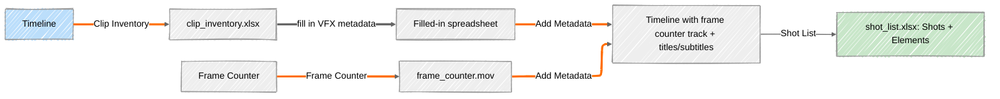

# Theia 明察秋毫

Theia is a suite of VFX editorial tools for **DaVinci Resolve Studio**. It connects to Resolve's scripting API to export clip inventories, generate frame counter videos, and manage shot metadata — all through standalone windows launched directly from Resolve's Scripts menu.

Named after the Greek Titan goddess of sight and heavenly light, 明察秋毫 ("to see the finest details with keen observation") is the idea behind the toolset: give editors and VFX coordinators a clear, detailed view into their timeline's VFX data.

!!! warning "Requires DaVinci Resolve Studio"
    Theia uses Resolve's scripting API, which is only available in **DaVinci Resolve Studio** (the paid version). The free version of Resolve does not include it.

## What's in the box

Theia is four independent tools that share a common pipeline. You don't have to use all of them — most editors start with Clip Inventory and add the others as needed.

-   :material-table: **[Clip Inventory](tools/clip-inventory.md)**

    Export every visible clip on your selected video tracks to an Excel spreadsheet, complete with thumbnails, timecodes, and reel names. Handles messy, multi-track timelines with transitions.

-   :material-counter: **[Frame Counter](tools/frame-counter.md)**

    Generate a MOV video of burned-in frame numbers, with timecode metadata embedded for editorial reference.

-   :material-file-document-edit: **[Add Metadata](tools/add-metadata.md)**

    Take a filled-in clip inventory spreadsheet and push it back into Resolve: place frame counter clips on the timeline, and/or export FCPXML title files and SRT subtitles from your metadata columns.

-   :material-format-list-bulleted: **[Shot List](tools/shot-list.md)**

    Build a structured VFX shot list — Shots and Elements sheets — directly from your timeline's frame counter track and per-element EDLs.

## How the pieces fit together

The four tools are designed to be used in sequence, with the Excel spreadsheet and frame counter video acting as the "glue" between Resolve and your VFX shot data:

If that looks like a lot, start with the [Quick Start](quick-start.md) guide — it walks through the minimum steps to get a clip inventory out of a timeline, which is where most workflows begin.

## Where to go next

* New to Theia? Start with [Installation](installation.md), then [Quick Start](quick-start.md).
* Already installed? Jump straight to the tool you need under **Tools** in the sidebar.
* Trying to do something specific end-to-end (e.g. "I need a VFX shot list from my timeline")? Check **Workflows** — each page is a step-by-step recipe that links back to the relevant tools.
* Something not working? See [Troubleshooting](troubleshooting.md).

## Project links

* Source code: [github.com/ming-qiu/theia](https://github.com/ming-qiu/theia)
* Support the project: [Buy Ming a tea ☕](https://buymeacoffee.com/ming_qiu)
