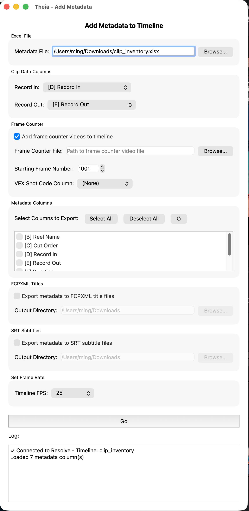

# Add Metadata

Reads a filled-in clip inventory spreadsheet and pushes it back into Resolve and onto disk, in up to three independent ways — placing frame counter clips on the timeline, exporting FCPXML title files, and exporting SRT subtitle files. All three can run together in a single pass.

 

!!! tip "Start with a Clip Inventory export"
    Add Metadata expects the spreadsheet shape that [Clip Inventory](clip-inventory.md) produces: bold **Record In**/**Record Out** headers and your own metadata typed into the columns after that. See [Export a Clip Inventory](../workflows/export-clip-inventory.md) if you haven't generated one yet.

## Launching it

**Workspace → Scripts → Edit → 03 Add Metadata**, with the matching timeline open.

## Interface reference

### Excel File

Path to your filled-in clip inventory spreadsheet. As soon as you enter or browse to a valid file, Theia reads its header row and populates every other section below — **Clip Data Columns**, **Metadata Columns**, and the **VFX Shot Code Column** dropdown all repopulate automatically.

### Clip Data Columns

Two dropdowns, **Record In** and **Record Out**, listing every column in your sheet that has a header. Theia tries to auto-select these by matching a column header named (case-insensitively) "Record In" or "Record Out" — which is exactly what Clip Inventory names them. If auto-detection doesn't find a match (for example, you renamed a column, or built the sheet by hand), pick the right columns yourself. **Go stays disabled until both are set.**

### Frame Counter

Adds a new video track to the timeline and places a frame counter clip at the position of every shot — but only for rows where a VFX shot code is filled in.

* **Add frame counter videos to timeline** — enables this operation. Checked by default.
* **Frame Counter File** — the `.mov` generated by the [Frame Counter](frame-counter.md) tool.
* **Starting Frame Number** — the frame number that corresponds to the first frame of the frame counter video (defaults to 1001, matching Frame Counter's own default Start value).
* **VFX Shot Code Column** — which metadata column holds the shot code used to name each placed clip. Required if Frame Counter is enabled; rows with this column empty are skipped. These named clips are exactly what the [Shot List](shot-list.md) tool later reads as the frame counter track.

### Metadata Columns

A checklist of every populated column in your sheet (aside from the thumbnail column). Whichever columns you check here are the ones written out by **FCPXML Titles** and **SRT Subtitles** below — typically your custom shot code, vendor, or note columns, but you can include any column.

* **Select All / Deselect All** — bulk toggle.
* **↻ (refresh)** — reload columns from the file (use after editing the spreadsheet without restarting Theia).

### FCPXML Titles

* **Export metadata to FCPXML title files** — when checked, writes one `.fcpxml` file per checked metadata column, named after the column header (e.g. a "VFX Shot Code" column becomes `VFX Shot Code.fcpxml`). Each file contains Basic Title elements timed to that column's Record In/Out, ready to import into Resolve as a title track.
* **Output Directory** — where the files are written. Defaults to `~/Downloads/`.

### SRT Subtitles

* **Export metadata to SRT subtitle files** — same idea as FCPXML, but writes one `.srt` file per checked column (e.g. `VFX Shot Code.srt`), for import as a subtitle track.
* **Output Directory** — defaults to `~/Downloads/`.

### Set Frame Rate

The timeline's frame rate, used to convert Record In/Out timecodes correctly for both the frame counter placement and the FCPXML/SRT timing. Theia attempts to auto-detect this from the currently open timeline; if it can't, or the value doesn't match a preset, **Custom...** appears with the detected (or last-used) value pre-filled. Double-check this matches your timeline before clicking Go.

### Go

Disabled until both Record In and Record Out columns are chosen. Validates that at least one of Frame Counter / FCPXML / SRT is enabled, then runs all enabled operations in one pass, logging progress for each.

## Output summary

| Operation | Output |
|---|---|
| Frame Counter | New video track on the open timeline, with one frame counter clip per shot, named by VFX shot code |
| FCPXML Titles | One `<column name>.fcpxml` file per selected column |
| SRT Subtitles | One `<column name>.srt` file per selected column |

## Tips

* You can run Add Metadata multiple times against the same spreadsheet as you fill in more columns — each run only touches the operations you've enabled.
* If the FCPXML or SRT files come out empty for a column, check that the corresponding rows in the spreadsheet actually have that column filled in — empty cells produce no title/subtitle entry.
* See [Add Metadata to a Timeline](../workflows/add-metadata-to-timeline.md) for the complete end-to-end workflow, including importing the FCPXML/SRT files back into Resolve.
