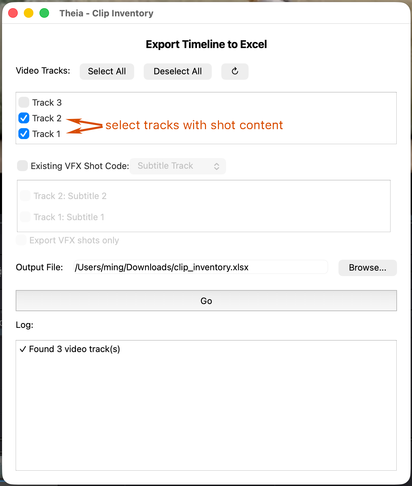
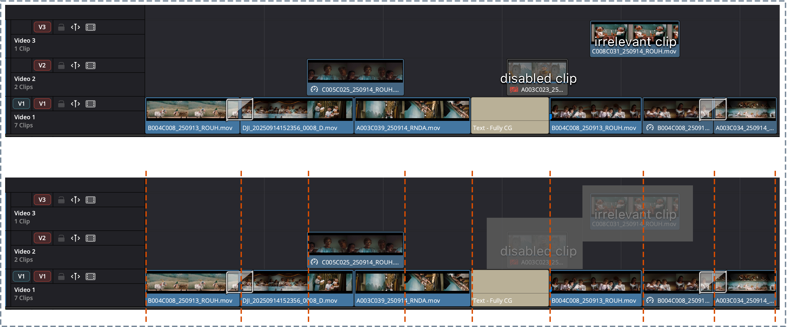
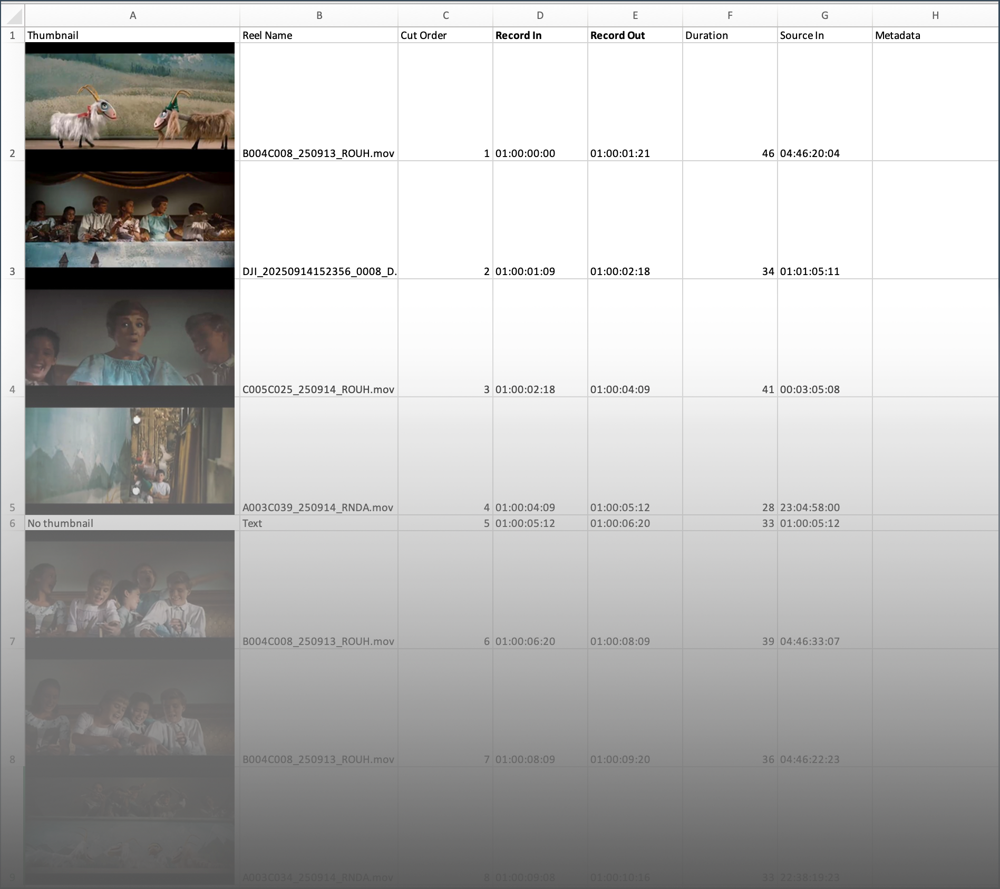
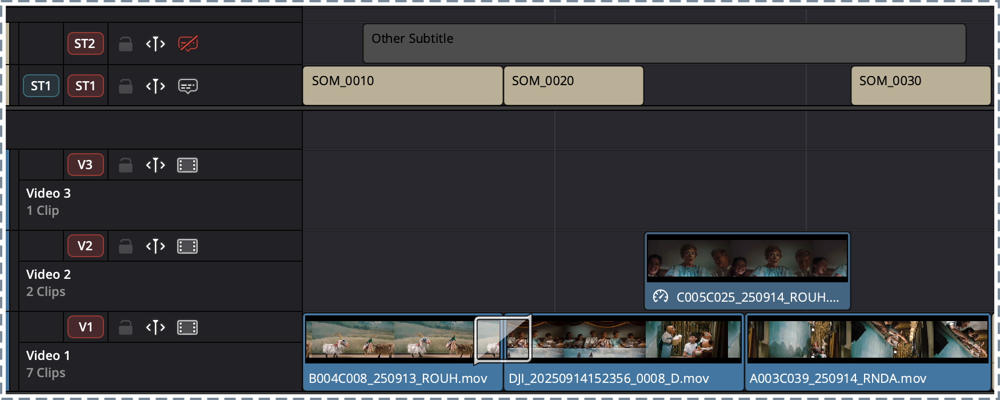
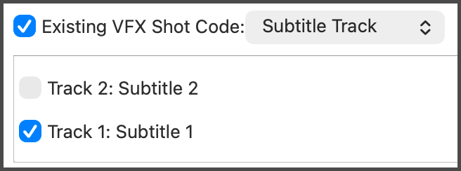
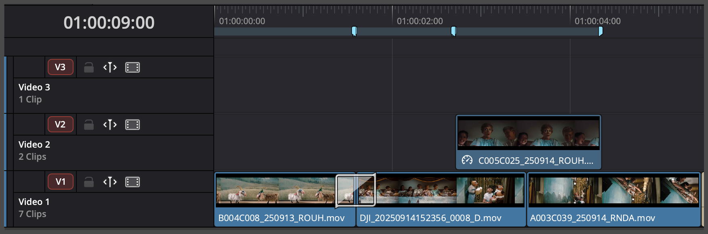

# Clip Inventory

Exports every visible clip on your selected video tracks to an Excel spreadsheet — with thumbnails, reel names, timecodes, and durations — so you have a clean starting point for adding VFX shot codes and other metadata by hand.

!!! note "Handles "unconsolidated" timelines"
    Clip Inventory accounts for multi-track occlusion (a clip on a higher track hides what's underneath it).

## Launching it

**Workspace → Scripts → Edit → 01 Clip Inventory**, with a timeline open in Resolve's Edit page.

In the following example, shot footage is on video track 1 and 2.

* See the [Export a Clip Inventory](../workflows/export-clip-inventory.md) workflow for the full step-by-step including what to do with the spreadsheet afterward.

**Fig. 1** Select tracks with shot content

{width=400}

**Fig. 2** How Clip Inventory interpret cut points

**Fig. 3** Exported Clip Inventory Excel sheet

{width=400}

**Fig. 4** Read existing VFX shot codes from a subtitle track

{width=260}

**Fig. 5** Read existing VFX shot codes from duration markers

{width=260}

## Interface reference

### Video Tracks

A checklist of every video track on the current timeline. All tracks are checked by default.

* **↻ (refresh)** — re-reads the track list from Resolve. Use this if you make changes or open a different timeline while the Theia window is already open.
* If no timeline is open, or Theia can't reach Resolve at all, the list falls back to a single "Track 1" checkbox so the window still opens.

Only clips on **checked** tracks are considered. Unchecked tracks are treated as if they don't exist.

### Existing VFX Shot Code

If your timeline already has VFX shots marked in a subtitle track or with duration markers, you have the option to only pull existing shot codes into the export. When checked, a dropdown lets you choose the source:

* **Subtitle Track** — reads shot codes from a subtitle track's text. Checking this reveals a second checklist of subtitle tracks on the timeline; pick exactly one (selecting a different one automatically deselects the previous choice).
* **Duration Marker** — reads shot codes from duration markers instead of a subtitle track.

**Export VFX shots only** (enabled only when "Existing VFX Shot Code" is checked) restricts the export to just the clips that have a shot code from the selected source, skipping everything else.

### Output File

Where the `.xlsx` file gets saved. Defaults to `~/Downloads/clip_inventory.xlsx`. Use **Browse...** to pick a different location, or type a path directly.

### Go

Starts the export. The log panel below streams progress live: which tracks are being processed, which clips are visible vs. occluded, and how transitions were classified.

## What ends up in the spreadsheet

| Column | Contents |
|---|---|
| Thumbnail | A frame grabbed from the in point of the clip on the timeline. |
| Reel Name | The clip's reel / source name from Resolve's media pool. |
| Cut Order | Sequential position in the timeline. |
| Record In / Record Out | Timeline (record) timecode of the clip's visible range. **Keep them named "Record In" / "Record Out"** if you rename columns, since [Add Metadata](add-metadata.md) auto-detects them by that name. |
| Duration | Length of the clip. |
| Source In | Source timecode of the clip at the in point of its visible range. |
| VFX Shot Code | Shot codes read from the subtitle track or duration marker. Only present if "Existing VFX Shot Code" was enabled. |
| Metadata (column H onward) | Left blank. This is where you fill in your own VFX shot codes, vendor assignments, descriptions, etc.. |

## About transitions

Transitions - anything Resolve labels as a dissolve, wipe, or fade - are handled depending on their locations:

* A dissolve **between two clips** on the same track is treated as a hard cut at its midpoint — the back half goes to the outgoing clip's range, the front half to the incoming clip's.
* A dissolve at the **end** of a clip (fading to nothing, or to another track) extends that clip's Record Out to cover half the dissolve.
* A dissolve at the **start** of a clip (fading in from nothing) extends that clip's Record In to cover half the dissolve.

## Known problems

* On the first run, the very first thumbnail might get lost in space. Re-running it usually solves the problem.
