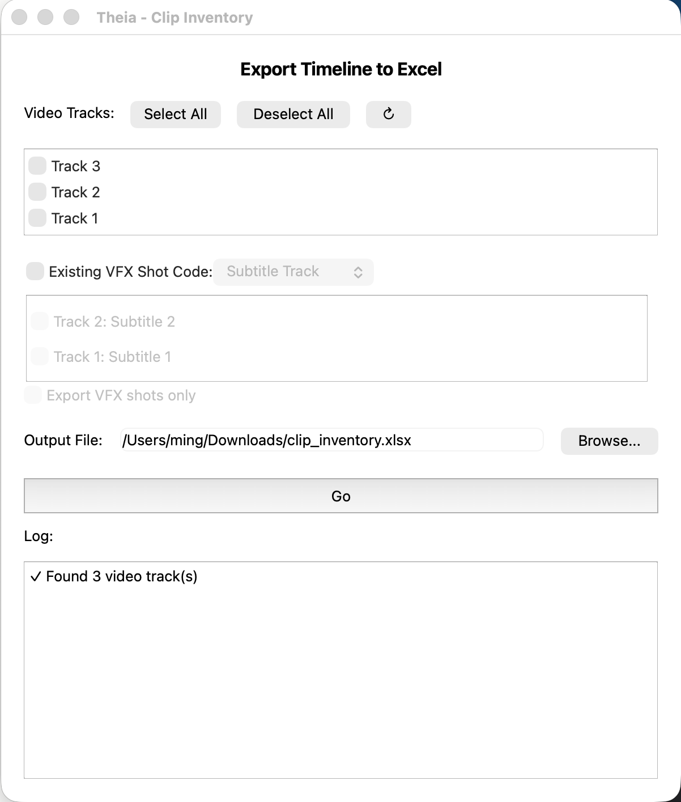

# Clip Inventory

Exports every visible clip on your selected video tracks to an Excel spreadsheet — with thumbnails, reel names, timecodes, and durations — so you have a clean starting point for adding VFX shot codes and other metadata by hand.

 

!!! info "Handles messy timelines"
    Clip Inventory accounts for multi-track occlusion (a clip on a higher track hides what's underneath it) and transitions (dissolves, wipes, fades), so you don't need a perfectly tidy single-track timeline before exporting.

## Launching it

**Workspace → Scripts → Edit → 01 Clip Inventory**, with a timeline open in Resolve's Edit page.

## Interface reference

### Video Tracks

A checklist of every video track on the current timeline, highest track on top (matching Resolve's own track order). All tracks are checked by default.

* **Select All / Deselect All** — bulk-check or uncheck every track.
* **↻ (refresh)** — re-reads the track list from Resolve. Use this if you open a different timeline while the window is already open.
* If no timeline is open, or Theia can't reach Resolve at all, the list falls back to a single "Track 1" checkbox so the window still opens.

Only clips on **checked** tracks are considered. Unchecked tracks are treated as if they don't exist — they won't occlude clips below them either.

### Existing VFX Shot Code

An optional checkbox that lets you pull existing shot codes into the export, if your timeline already has them marked some other way. When checked, a dropdown lets you choose the source:

* **Subtitle Track** — reads shot codes from a subtitle track's text. Checking this reveals a second checklist of subtitle tracks on the timeline; pick exactly one (selecting a different one automatically deselects the previous choice).
* **Duration Marker** — reads shot codes from timeline markers instead of a subtitle track.

**Export VFX shots only** (enabled only when "Existing VFX Shot Code" is checked) restricts the export to just the clips that have a shot code from the selected source, skipping everything else.

### Output File

Where the `.xlsx` file gets saved. Defaults to `~/Downloads/clip_inventory.xlsx`. Use **Browse...** to pick a different location, or type a path directly.

### Go

Starts the export. The log panel below streams progress live: which tracks are being processed, which clips are visible vs. occluded, and how transitions were classified. When it finishes, a dialog reports how many clips were exported and offers an **Open File** button to launch the spreadsheet immediately.

## What ends up in the spreadsheet

One row per **visible portion** of a clip — if a clip is partially covered by something on a track above it, only its visible range becomes a row. Columns, left to right:

| Column | Contents |
|---|---|
| Thumbnail | A frame grabbed from the middle of the clip's visible range. |
| Reel Name | The clip's reel/source name from Resolve's media pool. |
| Cut Order | Sequential position in the timeline, 1-based. |
| Record In / Record Out | Timeline (record) timecode for the visible range. These headers are bold so they stand out — keep them named "Record In" / "Record Out" if you rename columns, since [Add Metadata](add-metadata.md) auto-detects them by that name. |
| Duration | Length of the visible range. |
| Source In | The source-clip timecode corresponding to the start of the visible range. |
| VFX Shot Code | Only present if "Existing VFX Shot Code" was enabled — the shot code read from the subtitle track or duration marker. |
| Metadata (column H onward) | Left blank. This is where you fill in your own VFX shot codes, vendor assignments, descriptions, or anything else your pipeline tracks. |

## How occlusion and transitions are handled

Clip Inventory walks the timeline from the highest selected track down to the lowest, keeping a running record of which parts of the timeline are still "unclaimed." A clip only produces a row for the portion of its range that hasn't already been claimed by something on a track above it. Once every frame of the timeline has been claimed, lower tracks are skipped entirely — there's nothing left for them to be visible in.

Transitions (anything Resolve labels as a dissolve, wipe, or fade) are never exported as their own row. Instead, they're folded into the adjacent clip's range:

* A dissolve **between two clips** on the same track is treated as a hard cut at its midpoint — the back half goes to the outgoing clip's range, the front half to the incoming clip's.
* A dissolve at the **end** of a clip (fading to nothing, or to another track) extends that clip's exported range to cover half the dissolve.
* A dissolve at the **start** of a clip (fading in from nothing) extends that clip's range backward to cover half the dissolve.

Disabled clips (clips you've disabled in Resolve without removing them) are skipped entirely.

## Tips

* If a thumbnail looks like it came from the wrong clip on a busy multi-track section, that's the one case worth double-checking after export — Theia momentarily solos each track to get a deterministic thumbnail, but extremely fast cuts can occasionally still grab a neighboring frame.
* Run the export again any time after editorial changes — it always reads live from whatever timeline is currently open, so there's no "stale" state to worry about.
* See the [Export a Clip Inventory](../workflows/export-clip-inventory.md) workflow for the full step-by-step including what to do with the spreadsheet afterward.
