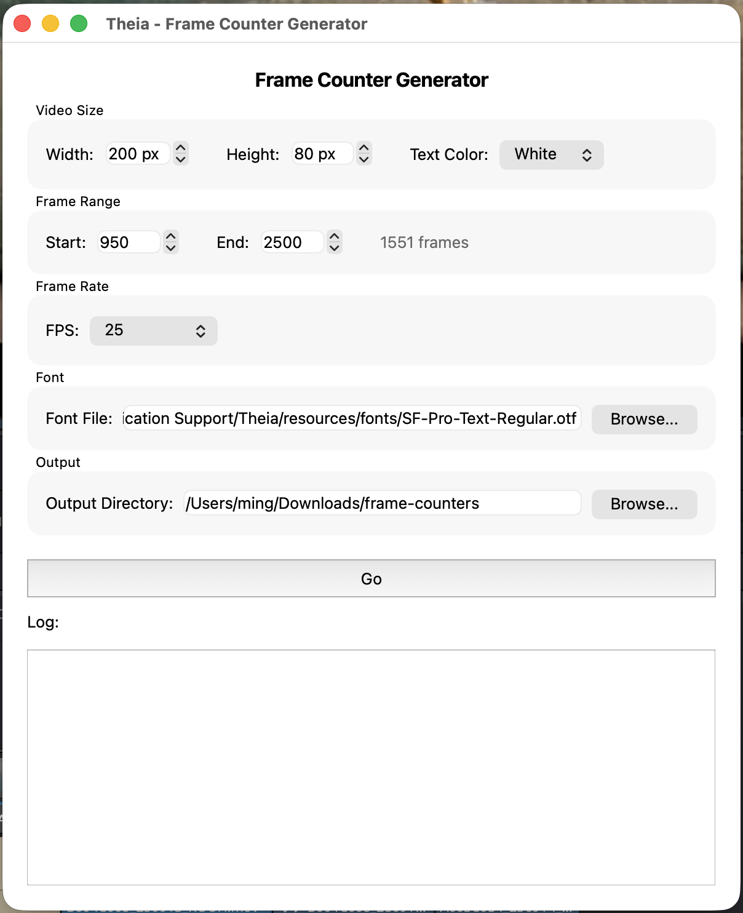
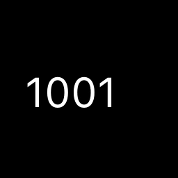

# Frame Counter

Generates a MOV of frame numbers with timecode metadata embedded.

 

Frame Counter is a standalone generator and doesn't read anything from Resolve. You set the size, frame range, and frame rate, and it renders a video to a folder you choose.

## Launching it

**Workspace → Scripts → Edit → 02 Frame Counter**

**Fig. 1** A typical setup

{width=400}

**Fig. 2** Generated frame counter video

{width=200}

## Interface reference

### Video Size

* **Width / Height** — in pixels, up to 3840×2160. Defaults to 200×80, since this is usually placed at a corner of the frame.
* **Text Color** — White, Green, or Yellow.

### Frame Range

* **Start / End** — the first and last frame numbers to generate.

### Frame Rate

Choose a preset (23.976, 24, 25, 29.97, 30, 60) or **Custom...** to type any other value. This determines both the embedded timecode and the playback rate of the rendered video. It should match the frame rate of the timeline you are working with.

### Font

Path to a `.otf` or `.ttf` font file used to draw the numbers. Defaults to the SF Pro font bundled with Theia (`/Library/Application Support/Theia/resources/fonts/SF-Pro-Text-Regular.otf`). If the path is invalid when you click **Go**, you'll be asked whether to continue with a plain default font.

### Output Directory

Where the finished video is written. Defaults to `~/Downloads/frame-counters`.

### Go

Generates the video. This happens in two passes, both visible in the log:

1. Render one PNG image per frame number, then encode them into a temporary video at your chosen frame rate.
2. Re-wrap that video to stamp in the starting timecode as embedded metadata (matching your Start frame), without re-encoding the image data.

The output file is named `frame_counter_<fps>fps.mov` (for example `frame_counter_24fps.mov`) in your chosen output directory.

!!! note "Encoder fallback"
    Frame Counter tries Apple's hardware encoder (`h264_videotoolbox`) first for speed, and falls back to software `libx264` automatically if that's unavailable. You'll see whichever one succeeded in the log.

## Best practices

* Generate a range comfortably longer than you expect to need.
* The frame rate you choose here must match what you'll tell [Add Metadata](add-metadata.md) when you place this video on the timeline, or the embedded timecodes won't line up with your shots.
* See [Generate Frame Counters](../workflows/generate-frame-counters.md) for the full workflow, including how this video feeds into Add Metadata and Shot List.
