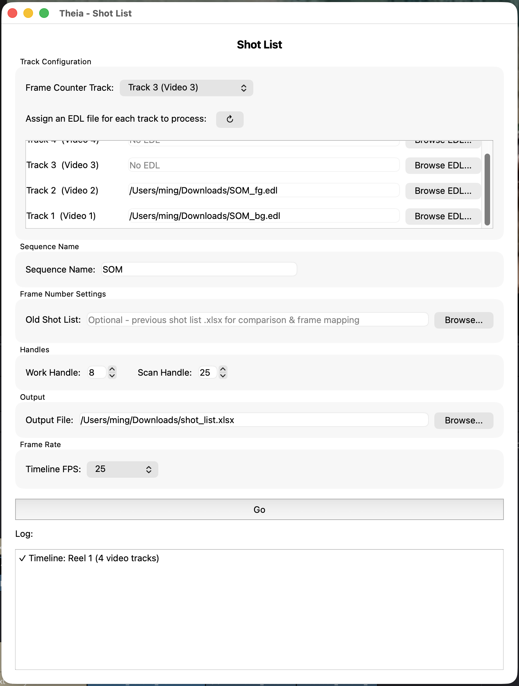
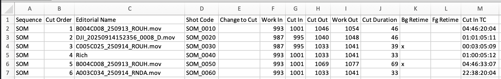
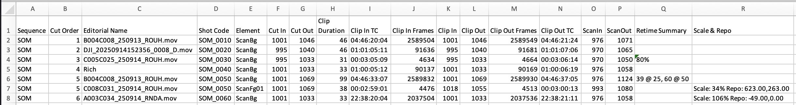

# Shot List

Builds a list of shots and a list of elements from your timeline. Listed information includes frame ranges, work / scan handles, retime, scale, reposition, etc.. Option to compare the current timeline against a previous shot list version and get changes in editorial points and retimes.

!!! info "Depends on Add Metadata's frame counter track"
    Shot List reads its shot boundaries and shot codes from a **frame counter track** that [Add Metadata](add-metadata.md) places on the timeline. Run Clip Inventory → fill in shot codes → Add Metadata (with Frame Counter enabled) before using Shot List. See [Export a Shot List](../workflows/export-shot-list.md) for the full chain.

!!! note "Handles "consolidated" timelines"
    Shot List assumes that the lowest selected track contains background elements, and anything selected above that are foreground elements. Make sure to consolidate all BG elements to 1 track.

## Prep

* Consolidate your BG track. In the following example, track 1 and 2 both contain BG elements and need to be consolidated into 1 track.

**Fig. 1 Consolidate timeline**

* Export an EDL for each track that contains shot content.

## Launching it

**Workspace → Scripts → Edit → 04 Shot List**, with the timeline (already containing a frame counter track) open.

**Fig. 2** A typical setup

{width=500}

**Fig. 3** Exported Shot List Excel sheet

* Shots:

* Elements:

## Interface reference

### Track Configuration

* **Frame Counter Track** — the video track containing the named frame counter clips that [Add Metadata](add-metadata.md) placed. Each clip's name is read as a shot code, and its position and length define that shot's cut in / out. **Required.**
* **Assign an EDL file for each track** — every track you want included requires an its own EDL file. A track left blank (no EDL) is ignored entirely and won't appear in the output.
* **↻ (refresh)** — re-reads the track list from Resolve (use after opening a different timeline).

!!! info "Lowest selected track is for background elements"
    The **lowest track** you assign an EDL to is treated as the track that contains all background elements. The BG element's reel name and source timecode become the shot's `Editorial Name` and `Cut In TC` on the Shots sheet, and it's labeled `ScanBg` on the Elements sheet. Every other EDL-assigned track is labeled `ScanFg01`, `ScanFg02`, and so on.

### Sequence Name

Optional. If left blank, Shot List derives a sequence name from each shot code by splitting on the first `_` or `-` (so `SEQ010_0010` → `SEQ010`). Fill this in to force every shot to use one sequence name instead.

### Frame Number Settings

* **Old Shot List** — optionally point this at a previous Shot List export (the `.xlsx` this same tool produced earlier). When set, Shot List matches shots by **Shot Code** and fills in a `Change to Cut` column showing how each shot's in/out frames moved since that version.

### Handles

* **Work Handle** — frames added before/after each shot's cut in/out to produce `Work In`/`Work Out` on the Shots sheet. Defaults to 8.
* **Scan Handle** — frames added before/after each *element's* in/out to produce `ScanIn`/`ScanOut` on the Elements sheet. Defaults to 24.

These are independent: Work Handle describes how much extra timeline you want editorial to protect around the cut; Scan Handle describes how much extra plate you're asking the scanning/ingest side to pull around each element.

### Output

Where the `.xlsx` file is saved. Defaults to `~/Downloads/shot_list.xlsx`.

### Frame Rate

Choose a preset (23.976, 24, 25, 30, 60) or **Custom...**. Shot List tries to auto-detect this from the open timeline when the window loads. This must match the timeline's actual rate — it's used to convert every timecode the EDLs and frame counter track reference.

### Go

Validates that a frame rate, Frame Counter Track, and output path are set, then processes every shot on the Frame Counter Track in timeline order.

## What ends up in the spreadsheet

Shot List writes two sheets.

**Shots**

| Column | Contents |
|---|---|
| Sequence | Derived from the shot code, or the Sequence Name override. |
| Cut Order | Sequential position of the shot on the Frame Counter Track. |
| Editorial Name | Reel name of the background (`ScanBg`) element. |
| Shot Code | The frame-counter clip's name. |
| Change to Cut | Only filled in if you supplied an Old Shot List — see below. |
| Cut In / Cut Out | The shot's frame range, read from the frame counter's embedded timecode/burn-in numbers. |
| Work In / Work Out | Cut In / Out minus / plus the Work Handle. |
| Cut Duration | `Cut Out - Cut In + 1`. |
| Bg Retime / Fg Retime | An `x` flag (not a percentage) if the background, or any foreground element, has a retime applied. The Elements sheet contains retime details for each element. |
| Cut In TC | Source timecode of the background element, taken from its EDL event. |

**Elements**

| Column | Contents |
|---|---|
| Sequence, Cut Order, Shot Code | Same as the matching row on the Shots sheet. |
| Editorial Name | This element's own reel name (from its EDL event, falling back to the Resolve clip name). |
| Element | `ScanBg` for the background track, `ScanFg01`, `ScanFg02`, etc. for foreground tracks. |
| Cut In / Cut Out | The parent shot's frame range (repeated on every element row for that shot). |
| Clip Duration (with dissolve before retime) | This element's own duration, including any dissolve-handle extension, before retime adjustment. |
| Clip In / Out, Clip In / Out Frames, Clip In / Out TC | The element's source in / out, in VFX frame numbers, raw frame numbers, and timecode |
| ScanIn / ScanOut | Clip In/Out minus/plus the Scan Handle — what to actually pull from the scan or source media. |
| Retime Summary | Empty if 100% speed. Otherwise either a percentage (e.g. `200%`) for a single retimed segment, or a breakdown like `48 @ 24, 72 @ 48` if a segmented non-linear retime, where `N @ x` means "take `N` frames of footage and make it `x` fps." |
| Scale & Repo | Zoom / pan / tilt on the element, summarized as `Scale: 110%` and / or `Repo: 300,-20`. |

## The Change to Cut diff

When you supply an **Old Shot List**, Shot List matches shots between the old and new files by **Shot Code** and compares `Cut In`/`Cut Out`. For any shot whose range changed, `Change to Cut` is filled in as:

* `In: <delta>` if only the in point moved,
* `Out: <delta>` if only the out point moved,
* `In: <delta>, Out: <delta>` if both moved,
* left blank if the shot is unchanged, is new (no matching shot code in the old file), or the old file had no valid in/out for that shot code.

Deltas are signed frame counts (e.g. `In: -12` means the shot now starts 12 frames earlier).

## Tips

* Run [Add Metadata](add-metadata.md)'s Frame Counter step again any time shot codes or cut points change on the timeline — Shot List always reflects whatever's currently placed on the Frame Counter Track.
* Keep a copy of each Shot List export before re-cutting — feeding the previous version back in as the **Old Shot List** is the easiest way to flag cut changes to vendors without manually diffing two spreadsheets.
* See [Export a Shot List](../workflows/export-shot-list.md) for the complete step-by-step, including how the Frame Counter Track gets created in the first place.
